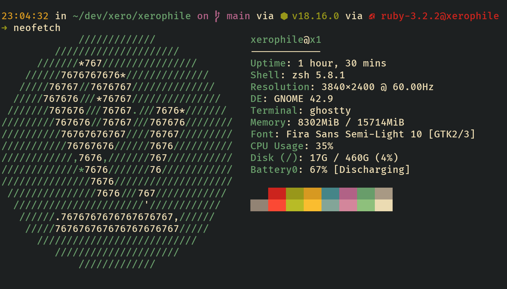

# Dotfiles

What it looks like:



> [!IMPORTANT]
> [Setup `zsh` config first](https://github.com/one-m1nd/prezto)

---

```bash
git clone git@github.com:one-m1nd/dotfiles.git "$HOME/.dotfiles"

cd "$HOME/.dotfiles"

./setup-dotfiles
```

## diff-highlight
1. Figure out where diff-highlight module is
Fedora: `rpm -ql git | grep diff-highlight`
Debian/Ubuntu/Mint: `dpkg -L git | grep diff-highlight`
Archlinux: `pacman -Ql git | grep diff-highlight`
2. cd to directory `sudo make`
3. `cp diff-higlight ~/bin`

## local
Mostly config for [konsole](https://konsole.kde.org/)

## ghosttty
Config for [ghostty](https://ghostty.org/)

## ranger
Config for [ranger](https://github.com/ranger/ranger)

## git
git config

## vim
vim config, powered via [vundle](https://github.com/VundleVim/Vundle.vim)

## TODO
1. Manage symlinks with [stow](https://www.gnu.org/software/stow/manual/stow.html)
    * Work config with symlinks is not always a good idea 